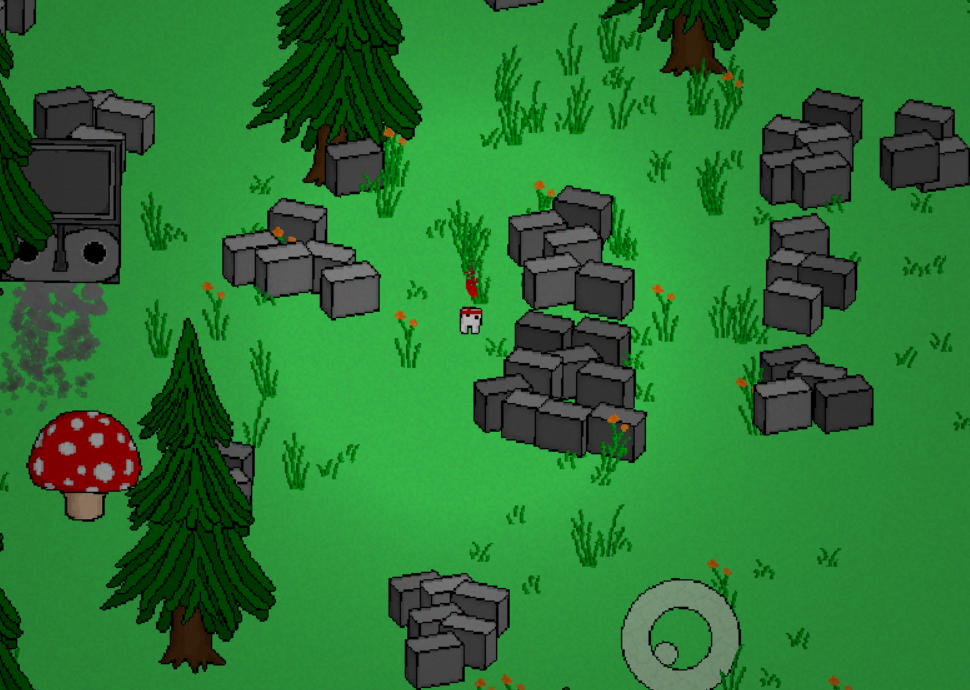
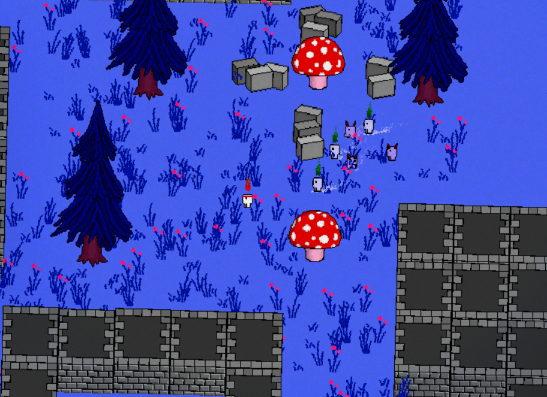

# PushOps
Hi, this is my game!
Here is an [outdated video demo.](https://youtu.be/q7SY_eWbJjM)

## [There's a discord too!](https://discord.gg/n6N24cUMDA)
If you have any suggestions or want to follow development- this is the
best place to be.

-----------------------------------------------------------

# [Here is the Steam page.]()
## WARNING: This code repository holds stuff that may not be 100% working.
If you aren't a programmer and would like to play, I would recommend buying the game officially from Steam. It's not very expensive!

However, if you want to run it anyway, the game is written in love2d.
To run, navigate to the directory and run `love .` in the terminal.

# Contribution!
Feel free to contribute to the project!! :)

Be warned though-
A lot of the code here was written when I was still learning,
so some of the code isn't the best. The worldgen is particularly scuffed IMO.
Also, when this project was nearing completion, I took a few "shortcuts" that
caused quite a bit of technical debt in the codebase. Just be wary of this!

Overall the codebase is still relatively modular and still follows a nice
ECS-like design, so it's not too bad.

# Codebase structure:
To read about the codebase structure and how it all fits together,
follow [This link here.](txt_and_images/codebase/codebase.md)

-----------------------------------------------------------

# Controls:

`WASD` to move.

Arrow keys to push and pull.

`escape` to pause.

# Some things to know:

Clojure is not actually used here! The language used is Fennel, a lisp dialect that transpiles to lua

Files starting with `NM` are not my own. (i.e. other people's code.)

